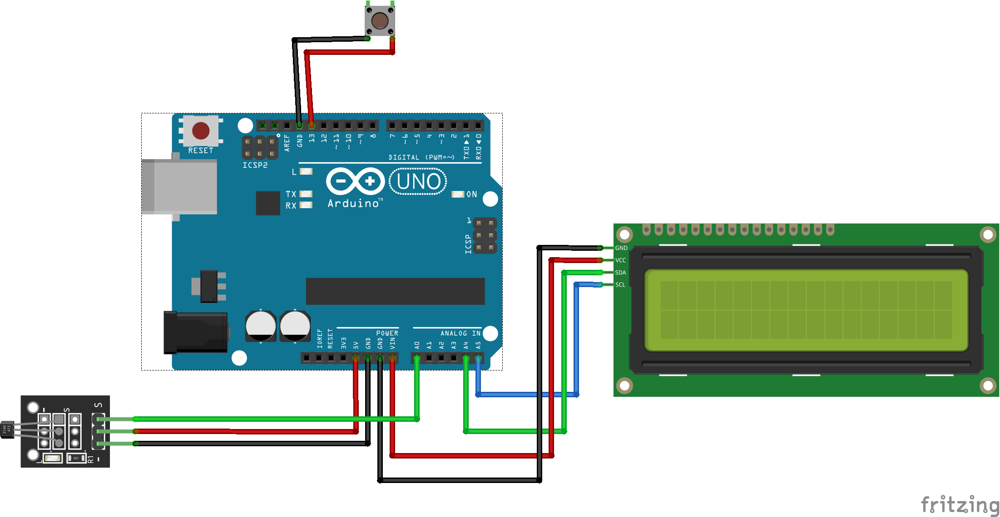

# arduino-speedometer

   
    
 <b>Bike computer based on arduino and Hall Sensor</b>   

## Overview

  This repository contains the Arduino code and project documentation for a bike computer based on Arduino and a Hall Sensor. The system accurately measures wheel movement to provide valuable bike metrics such as speed, distance covered, time, maximum speed, acceleration, and velocity-time graphs.

## Demonstration

   
  A 3D animation illustrates the bicycle equipped with the hardware.

 

## How it works?

   
  Wiring diagram depicting the project setup

  
<h3>Analog Hall Sensor KY-035 Value when the Magnet Passes By</h3>

 

 

  The system calculates bike metrics by analyzing the time difference between sensor triggers when the magnet passes by it. The setup involves placing a magnet on the front wheel's spokes, triggering a Hall Sensor on the fork. This data is then processed by an Arduino Uno powered by a Xiaomi PowerBank.

## Compacting..

  
  
  

  Close-up view of compacting the bicycle with the device

 

  The Arduino and power bank are located on the bike frame, the magnet on the bike spoke, and the Hall sensor on the bike fork, secured with hot glue. The LCD display 16x02 (20x04 will work as well) is mounted on the handlebars, right in front of the rider's eyes."

